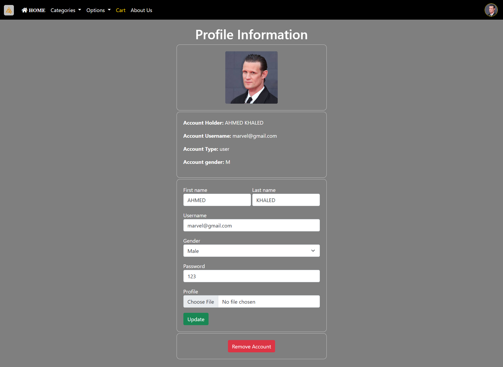

# Library Management System

## Overview

- The Library Management System is a comprehensive web-based application that enables users to manage a library's collection of books efficiently. This system was developed using HTML, CSS, JavaScript for the front end, and PHP and SQL for the back end. It caters to different user roles, providing a rich set of features for both library staff and patrons.
- The A.I. stands for Ahmed & Ibrahim the developers of the website and on that basis, our logo was founded.
- The library passed through two core processes, the first process was the implementation of the front-end using HTML & and CSS which was in my first year at college, and the second process was introducing the website in a dynamic way by adding a back-end using PHP and SQL which was one year later in an ITI internship.

## Features

### Common Features for Normal and Admin Users:

- **Book Catalog**: Enables users to search, add, remove, and categorize books within the library.

- **Account Management**: Allows users to change their account email, password, profile picture, and gender.

### Features for Normal Users:

- **Cart Management**: Patrons can add and remove books from their cart, facilitating a streamlined checkout process.

### Features for Admin Users:

- **User Management**: Admins can list user accounts and view the contents of user carts, providing essential administrative control.

- **Book Management**: Admins can add new books to the library's collection, update existing book, and delete books as needed.

### Account Deletion:

- **Account Deletion**: Both normal and admin users have the ability to delete their accounts when necessary.

## Technologies Used

- **Front-end**:
    - HTML
    - CSS
    - JavaScript

- **Back-end**:
    - PHP
    - SQL (for database management)

## Screenshots

## Installation

1. Clone the repository.
2. You should have xampp to serve as a localhost server.
3. There you go.

